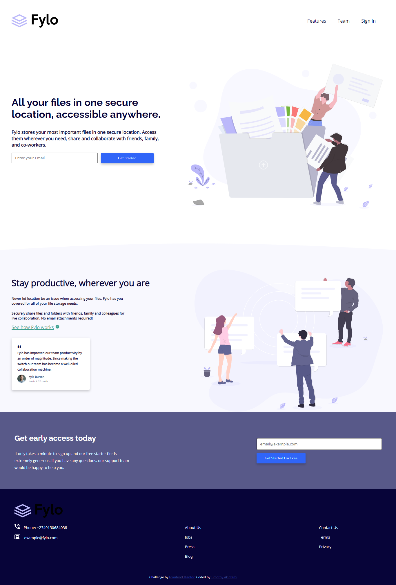

# Frontend Mentor - Fylo landing page with two column layout solution

This is a solution to the [Fylo landing page with two column layout challenge on Frontend Mentor](https://www.frontendmentor.io/challenges/fylo-landing-page-with-two-column-layout-5ca5ef041e82137ec91a50f5). Frontend Mentor challenges help you improve your coding skills by building realistic projects. 

## Table of contents

- [Overview](#overview)
  - [The challenge](#the-challenge)
  - [Screenshot](#screenshot)
- [My process](#my-process)
  - [Built with](#built-with)
  - [What I learned](#what-i-learned)
  - [Continued development](#continued-development)
- [Author](#author)
- [Acknowledgments](#acknowledgments)

### The challenge

-The challenge is to create a replica of the landing page design above using the resources provided.

Users should be able to:

- View the optimal layout for the site depending on their Computer screen. 
- See hover states for all interactive elements on the page

### Screenshot

Then crop/optimize/edit your image however you like, add it to your project, and update the file path in the image above.

## My process

Started with skeleton/structure of the webpage then moved to the styling using CSS.

### Built with

- Semantic HTML5 markup
- CSS custom properties
- Flexbox
- CSS Grid

### What I learned

I learned and got a better understanding of how layout of webpages work and how to manipulate them to your taste using CSS.

### Continued development

I would like to develop more in the aspect of responsiveness and layout across several device displays.

## Author

Frontend Mentor - [@Timothy2226](https://www.frontendmentor.io/profile/Timothy2226)

## Acknowledgments

Frontend Mentor as made all these possible and easy with well guided instructions to help. Also, Angela yu's is just amazing her course on web development on udemy has really helped me to understand web design indepthly.